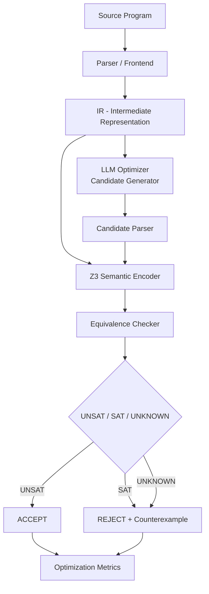

# Architecture

## Pipeline

## The core principle

**LLM proposes → Formal verifier proves/rejects → Optimizer selects.**

The LLM (or the mock generator standing in for one) never decides
correctness. Every candidate, regardless of source, is:

1. Parsed as untrusted JSON (never executed, never eval'd).
2. Validated against a whitelist of IR instruction shapes (`app/compiler/ir.py`).
3. Encoded into Z3 and checked for semantic equivalence against the original.
4. Accepted *only* if Z3 proves `UNSAT` on "does an input exist where outputs differ".

## Module boundaries

| Layer | Path | Responsibility |
|---|---|---|
| Compiler frontend | `backend/app/compiler/` | lexer, parser, AST, IR, AST→IR lowering |
| Optimizer | `backend/app/optimizer/` | candidate generation (mock/Ollama), candidate parsing, peephole simplifier, accept/reject decision |
| Verifier | `backend/app/verifier/` | Z3 encoding, equivalence checking, counterexamples |
| Metrics | `backend/app/metrics/` | IR-level instruction-count metrics |
| API | `backend/app/api/` | FastAPI routes tying the above together |
| Frontend | `frontend/` | React dashboard |
| Benchmarks | `benchmarks/` | JSONL programs with known-correct equivalence properties |
| Experiments | `experiments/` | offline batch runner + result analysis |

Each layer only depends on layers to its left in that table (API depends
on optimizer/verifier/metrics/compiler; optimizer depends on compiler and
verifier; verifier depends only on compiler). The frontend only ever
talks to the API over HTTP.
